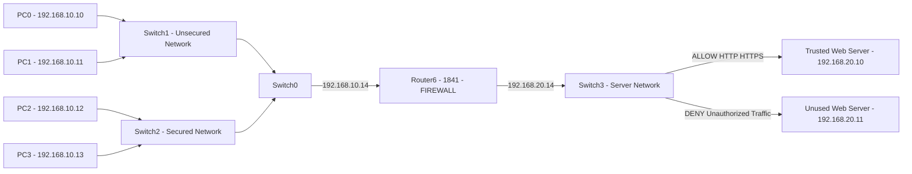
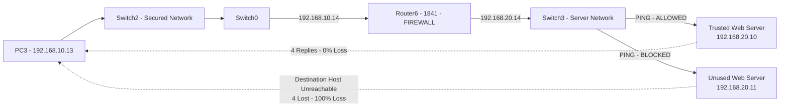

CO4_AT3: DESIGN ASSESSMENT:

Tittle:Design and Implement Firewall Rules to Secure a Web Server

1. Aim:

To design and implement firewall rules that secure a web server by permitting legitimate client requests, restricting unauthorized access, controlling service-specific traffic, and evaluating the effectiveness of the rules through different access and connectivity scenarios.

2. Objective:

- Allow legitimate clients to access the trusted web server.
- Permit required web services such as HTTP and HTTPS.
- Block unauthorized users and unknown networks.
- Restrict unnecessary service-specific traffic.
- Prevent access to an untrusted web server.
- Test the firewall rules using different connectivity scenarios.
- Verify that the implemented rules provide effective network security.

3. Network Design:

## Network Flow Chart

The network consists of multiple client PCs connected through switches and a router. The router/firewall controls communication between the internal client network and the web servers.

## IP Addressing

| Device | IP Address | Role |
|---|---|---|
| PC0 | 192.168.10.10 | Authorized Client |
| PC1 | 192.168.10.11 | Authorized Client |
| PC2 | 192.168.10.12 | Authorized Client |
| PC3 | 192.168.10.13 | Authorized Client |
| Trusted Web Server | 192.168.20.10 | Protected Web Server |
| Untrusted Web Server | 192.168.20.11 | Restricted Server |

4. Firewall Rule Design:

The firewall follows a default-deny approach, where only required and legitimate traffic is permitted.

## Firewall Rule Design

| Rule | Source | Destination | Service/Port | Action | Purpose |
|---:|---|---|---|---|---|
| 1 | Authorized Clients | Trusted Web Server | HTTP (80) | Allow | Permit web access |
| 2 | Authorized Clients | Trusted Web Server | HTTPS (443) | Allow | Permit secure web access |
| 3 | Authorized Clients | Trusted Web Server | ICMP | Allow | Connectivity testing |
| 4 | Any Unauthorized Source | Trusted Web Server | HTTP/HTTPS | Deny | Block unauthorized access |
| 5 | Any Client | Untrusted Web Server | HTTP/HTTPS | Deny | Prevent access to untrusted server |
| 6 | Any Source | Trusted Web Server | FTP (21) | Deny | Restrict unnecessary service |
| 7 | Any Source | Trusted Web Server | Telnet (23) | Deny | Prevent insecure remote access |
| 8 | Any Other Traffic | Protected Network | Any | Deny | Final security rule |

5. Implementation:

The firewall rules are implemented on the network router/firewall.

The implementation provides:

- HTTP access: Allowed for legitimate clients.
- HTTPS access: Allowed for legitimate clients.
- ICMP: Allowed for connectivity testing.
- FTP: Blocked because it is not required for the web server.
- Telnet: Blocked because it is an insecure service.
- Unauthorized access: Denied.
- Untrusted server access: Denied.
- Other unspecified traffic: Denied by the final rule.

6. Security Principle:

The firewall uses the least-privilege principle. Only the traffic required for the web server operation is permitted. All unnecessary and unauthorized traffic is blocked.

This reduces the attack surface and prevents clients from accessing services that are not required.

7. Test Scenarios:

Test Case 1 – Legitimate HTTP Access:

- Source: PC0
- Destination: 192.168.20.10
- Port: 80
- Expected Result: Access Allowed
- Actual Result: Web page loaded successfully.

Test Case 2 – Legitimate HTTPS Access:

- Source: PC1
- Destination: 192.168.20.10
- Port: 443
- Expected Result: Access Allowed
- Actual Result: Secure web access was permitted.

Test Case 3 – Unauthorized Web Access:

- Source: Unauthorized Client
- Destination: 192.168.20.10
- Port: 80/443
- Expected Result: Access Denied
- Actual Result: Connection was blocked by the firewall.

Test Case 4 – Access to Untrusted Server:

- Source: Any Client
- Destination: 192.168.20.20
- Port: 80/443
- Expected Result: Access Denied
- Actual Result: Access was blocked.

Test Case 5 – FTP Access:

- Source: Any Client
- Destination: 192.168.20.10
- Port: 21
- Expected Result: Access Denied
- Actual Result: FTP connection was blocked.

Test Case 6 – Telnet Access:

- Source: Any Client
- Destination: 192.168.20.10
- Port: 23
- Expected Result: Access Denied
- Actual Result: Telnet connection was blocked.

Test Case 7 – ICMP Connectivity:

- Source: Authorized Client
- Destination: 192.168.20.10
- Protocol: ICMP
- Expected Result: Ping Successful
- Actual Result: Connectivity was verified successfully.

8. Test Results:

## Test Results

| Test | Scenario | Expected Result | Result |
|---:|---|---|---|
| 1 | Authorized HTTP access | Allowed | Passed |
| 2 | Authorized HTTPS access | Allowed | Passed |
| 3 | Unauthorized web access | Blocked | Passed |
| 4 | Client → Untrusted Server | Blocked | Passed |
| 5 | FTP access | Blocked | Passed |
| 6 | Telnet access | Blocked | Passed |
| 7 | Authorized ICMP | Allowed | Passed |

## Connectivity Test - PC3

| Test | Source | Destination | Result |
|---:|---|---|---|
| 1 | PC3 (192.168.10.13) | Trusted Server (192.168.20.10) | 4/4 replies - 0% loss |
| 2 | PC3 (192.168.10.13) | Unused Server (192.168.20.11) | Blocked - 100% loss |

9. Effectiveness Evaluation:

The firewall rules were effective because legitimate web traffic was permitted while unauthorized and unnecessary traffic was blocked.

The testing demonstrated that:

- Authorized clients can access the trusted web server.
- Required HTTP and HTTPS services are available.
- Unauthorized web access is restricted.
- Access to the untrusted server is prevented.
- FTP and Telnet traffic are blocked.
- Network connectivity can be verified using ICMP.
- The default-deny rule prevents unspecified traffic from passing through the firewall.

10. Security Benefits:

- Protects the web server from unauthorized access.
- Reduces unnecessary network exposure.
- Controls traffic according to service and port.
- Prevents access to untrusted resources.
- Follows the principle of least privilege.
- Provides a clear and testable firewall policy.
- Improves overall network security.

11. Conclusion:

The firewall was successfully designed to protect the trusted web server. Legitimate HTTP, HTTPS, and required connectivity traffic were permitted, while unauthorized access, untrusted server communication, FTP, Telnet, and other unnecessary traffic were restricted.

The different connectivity and access tests confirmed that the firewall rules operate as intended. Therefore, the implemented firewall provides an effective method for controlling network traffic and securing the web server.
